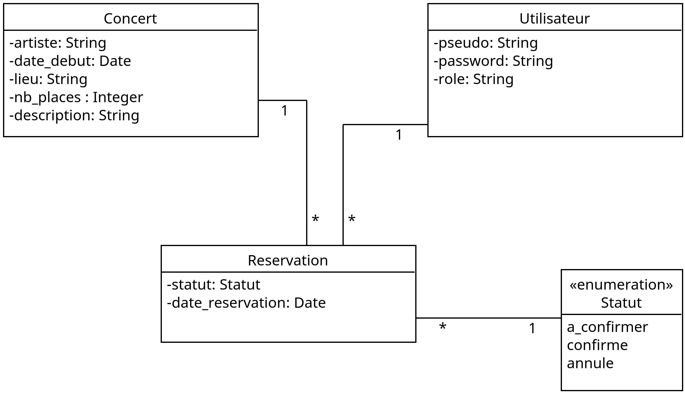
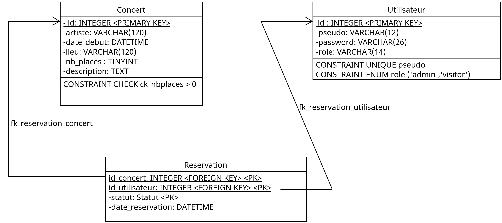

# Documentation du projet: choix de conception et d'implémentation

- [Documentation du projet: choix de conception et d'implémentation](#documentation-du-projet-choix-de-conception-et-dimplémentation)
  - [Conception de l'API](#conception-de-lapi)
    - [1. Déterminer l'ensemble des données](#1-déterminer-lensemble-des-données)
    - [2. **Décomposer** l'ensemble de données en ressources](#2-décomposer-lensemble-de-données-en-ressources)
    - [3. **Nommer** les ressources avec des URI](#3-nommer-les-ressources-avec-des-uri)
    - [4. **Implémenter** un sous-ensemble de l'interface uniforme (`GET`, `POST`, `DELETE`, `PUT`) pour chaque ressource](#4-implémenter-un-sous-ensemble-de-linterface-uniforme-get-post-delete-put-pour-chaque-ressource)
    - [5. **Étudier** la ou les représentations acceptées par les clients](#5-étudier-la-ou-les-représentations-acceptées-par-les-clients)
      - [Ressource *Les concerts à venir* `/concerts` :](#ressource-les-concerts-à-venir-concerts-)
      - [Ressource *Informations sur un concert* `/concerts/{id}`](#ressource-informations-sur-un-concert-concertsid)
      - [Ressource *Réservation d'une place de concert* `/concerts/{id}/reservations`](#ressource-réservation-dune-place-de-concert-concertsidreservations)
      - [Ressource *S'authentifier* : `POST /login`](#ressource-sauthentifier--post-login)
    - [6. **Concevoir** la ou les représentations à mettre à disposition des clients](#6-concevoir-la-ou-les-représentations-à-mettre-à-disposition-des-clients)
      - [Faire une réservation](#faire-une-réservation)
      - [Confirmer une réservation](#confirmer-une-réservation)
      - [Annuler une réservation](#annuler-une-réservation)
    - [S'authentifier](#sauthentifier)
    - [8. Envisager la progression typique des évènements](#8-envisager-la-progression-typique-des-évènements)
    - [9. Envisager les cas d'erreurs](#9-envisager-les-cas-derreurs)
  - [Conception de la base de données relationnelle](#conception-de-la-base-de-données-relationnelle)
    - [Conception de la base de données: du MCD au MPD](#conception-de-la-base-de-données-du-mcd-au-mpd)

## Conception de l'API

Nous reprenons la démarche générale, proposée par [Leonard Richardson](https://www.oreilly.com/pub/au/2556) et [Sam Ruby](https://en.wikipedia.org/wiki/Sam_Ruby)

1. **Déterminer** l'ensemble de données
2. **Décomposer** l'ensemble de données en ressource

**Pour chaque type de ressource**:

3. **Nommer** les ressources avec des URI
4. **Implémenter** un sous-ensemble de l'interface uniforme (GET, POST, DELETE, PUT)
5. **Étudier** la ou les représentations acceptées par les clients
6. **Concevoir** la ou les représentations à mettre à disposition des clients
7. **Intégrer** la ressource parmi celles qui existent déjà, en utilisant des hypermédias
8. **Envisager** la progression typique des évènements: qu'est-ce qui est censé se produire ? [Le flux de contrôle standard comme le protocole de publication Atom](https://www.ibm.com/docs/fr/integration-designer/8.5.5?topic=formats-atom-feed-format) peut aider.
9. **Considérer** les cas d'erreurs: qu'est-ce qui peut mal se passer ? Encore une fois, les flux de contrôle standard peuvent aider.

### 1. Déterminer l'ensemble des données

Commençons par un [dictionnaire des données](https://www.univ-constantine2.dz/CoursOnLine/Benelhadj-Mohamed/co/grain3_2.html)

Légende:

- AN : alphanumérique
- N: numérique
- A: alphabétique
- D: Date (et datetime)
- B: Booléen

|  Code 	| Désignation  	| Type  	|  Taille (nb caractères ou chiffres) 	| Remarque  	|
|---	|---	|---	|---	|---	|
|   `pseudo`	|  Le pseudo d’un utilisateur 	|   AN	|   12	|    Identifie de manière unique l’utilisateur	|
|   `description`	|  Un texte court qui décrit le concert, son contexte, 	|   AN	|   1000	|   	|
|   `artiste`	|   Le nom de l'artiste qui se produit lors du concert	|   AN	|  120 	|   	|
|   `date_debut`	|   Date et horaire du concert	|  D 	|   20	|   YYYY-mm-dd HH:mm:ss (et TimeZone)	|
|   `date_reservation`	|   Date à laquelle l’utilisateur reserve sa place	|  D 	|   20	|   Attention, ce n'est pas la date a laquelle iel confirme la réservation	|
|   `lieu`	|  Lieu, salle où se déroule le concert  	|   AN	|   120	|   	|
|   `nb_places`	|  Le nombre de places disponibles à la réservation pour un concert  	|   N	|   < 100 000	|   	|
|   `statut`	|  État d’une réservation. 3 statuts possibles : A confirmer, Confirmée, Annulée  	|   N	|   14	|  Lorsqu’une réservation est créée, elle a par défaut le statut "À confirmer". Elle doit ensuite être confirmée par l'utilisateur. Un utilisateur qui a confirmé sa reservation ne peut plus l’annuler ! 	|
|   `a_confirmer`	|  Statut d’une réservation en attente de confirmation  	|   A	|   14	|   Ce statut peut passer à l’état Confirmée ou Annulée	|
|   `confirmee`	|  Statut d’une réservation confirmée  	|   A	|   14	|   Ne peut s’appliquer que sur un statut dans l’état a_confirmer. Cet état ne peut plus changer par la suite	|
|   `annulee`	|  Statut d’une réservation annulée  	|   A	|   14	|   Ce statut ne peut plus changer par la suite	|

### 2. **Décomposer** l'ensemble de données en ressources

Décomposons ces données en ressources :

- **Concert** : date_debut, lieu, nb_places, description, artiste
- **Réservation** : statut, date_reservation

> Ces ressources nous permettront de créer le schéma de la base de données également. Les utilisateurs ne sont pas une ressource, ce ne sont pas des informations exposées par le système !

### 3. **Nommer** les ressources avec des URI

- Ressource *Les concerts à venir* : `/concerts`
- Ressource *Informations sur un concert* : `/concerts/{id}`, où `id` est un identifiant unique d'un concert
- Ressource *Réservation d'une place de concert*: `/concerts/{id}/reservations`. 

### 4. **Implémenter** un sous-ensemble de l'interface uniforme (`GET`, `POST`, `DELETE`, `PUT`) pour chaque ressource

- Ressource *Les concerts à venir* `/concerts` : `GET`
- Ressource *Informations sur un concert* `/concerts/{id}` : `GET`
- Ressource *Réservation d'une place de concert* `/concerts/{id}/reservations` : `GET`, `POST`, `PUT`, `DELETE`

> `GET /concerts/{id}/reservations` est protégée, seul le gestionnaire du site pourra lister les réservations effectuées pour un concert (et donc la liste des pseudos des utilisateurs).

### 5. **Étudier** la ou les représentations acceptées par les clients

L'API renverra des données au format `application/hal+json`, en suivant la spécification [HAL](https://datatracker.ietf.org/doc/html/draft-kelly-json-hal-08)

On définit ici les représentations des ressources envoyées par le serveur au client.

#### Ressource *Les concerts à venir* `/concerts` : 

Schéma type

~~~JSON
{
     "_links": {
       "self": { "href": "/concerts" },
     },
     "_embedded": {
       "concerts": [{
           "_links": {
             "self": { "href": "/concerts/1" },
           },
            "date": '2023-02-17 21:00:00',
            "lieu": "Rennes, Salle de la Cité",
            "artiste": "Eels",
         },{
           "_links": {
             "self": { "href": "/concerts/2" },
           },
            "date": '2023-06-22 20:30:00',
            "lieu": "Nantes, Stéréolux",
            "artiste": "Cat Stevens",
         }]
     },
     "nbConcerts": 2
   }
~~~

> La ressource a deux ressources "embarquées" qui sont les "concerts", sous la clef [`_embeded`](https://datatracker.ietf.org/doc/html/draft-kelly-json-hal-08#section-4.1.2). On donne ici seulement les informations essentielles sur chaque concert. La ressource a pour propriété le nombre de concerts à venir.

#### Ressource *Informations sur un concert* `/concerts/{id}` 

Schéma type

~~~JSON
{
     "_links": {
       "self": { "href": "/concerts/1" },
       "reservation" : {"href" : "/concerts/1/reservation"}
     },
    "id": 1,
    "date": '2023-02-17 21:00:00',
    "nb_places": 400,
    "nb_places_disponibles": 250,
    "lieu": "Rennes, Salle de la Cité",
    "artiste": "Eels",
    "description": "Lore ipsum" 
}
~~~

#### Ressource *Réservation d'une place de concert* `/concerts/{id}/reservations`

Lister les réservations d'un concert : `GET /concerts/{id}/reservations`

~~~JSON
{
     "_links": {
       "self": { "href": "/concerts/1/reservations" },
       "concert" : {"href" : "/concerts/1"}
     },
     "_embedded" : 
        "reservations": [{
            "pseudo" : "john",
            "statut" : "a_confirmer"
        },
        {
            "pseudo" : "eve44",
            "statut" : "confirmee"
        },
     ],
     "nbReservations": 2,
}
~~~

>Cette ressource n'est accessible qu'au gestionnaire du site !

Effectuer une réservation `POST /concerts/{id}/reservations`

~~~JSON
{
     "_links": {
       "self": { "href": "/concerts/1/reservations" },
       "concert": { "href": "/concerts/1" },
       "confirmer": { "href": "/concerts/1/reservations" },
       "annuler": { "href": "/concerts/1/reservations" },
     },
     "_embedded" : 
        "concert": {
            "lieu": "Rennes, Salle de la Cité",
            "artiste": "Eels",
            "date": '2023-02-17 21:00:00',
        },
     ],
     "dateReservation": '2023-01-03 17:32:22'
     "pseudo": "john",
     "status": "a_confirmer",
}
~~~

Annuler une réservation : `DELETE /concerts/{id}/reservations`

>Même schéma que précédemment

Confirmer une réservation : `PUT /concerts/{id}/reservations`

>Même schéma que précédemment

>Ici, sous la clef `_links` on indique les ressources connexes, notamment les liens pour confirmer ou annuler la réservation. Vous remarquerez que ce sont les mêmes que self, alors pourquoi les mettre ? Pour indiquer à l'agent qui consomme l'API les actions possibles (on appelle ça le [link relation type](https://datatracker.ietf.org/doc/html/rfc5988#section-4), comme le contenu d'une balise a HTML). On n'indique pas la méthode HTTP, car on sait qu'on se conforte à l'interface uniforme (GET, POST, PUT, DELETE). Une requête `OPTIONS` sur la ressource indiquera à l'agent les verbes autorisés. Ici on a GET, POST, PUT et DELETE. GET est reservé pour lister les réservations d'un concert (route protégée), `POST` est utilisé pour effectuer une réservation. Il reste donc PUT et DELETE. DELETE va servir à annuler une reservation. Donc on peut facilement en déduire que PUT va confirmer la réservation. Si on a un doute, on peut toujours tester ! 

#### Ressource *S'authentifier* : `POST /login`

Schéma type :

~~~JSON
{
     "_links": {
       "self": { "href": "/login" },
       "concerts": { "href": "/concerts/" },
       "reservations": { "href": "/concerts/{id}/reservations" },
     },
     "token": "XXXX.YYYYY.ZZZZZ",
}
~~~

### 6. **Concevoir** la ou les représentations à mettre à disposition des clients

Maintenant, il faut déterminer les représentations que les clients peuvent fabriquer et qui seront comprises par le serveur. Il faut définir la représentation pour :

- créer une reservation
- confirmer une reservation
- annuler une reservation
- s'authentifier

Le client enverra sa représentation au format `application/x-www-form-urlencoded` (forumlaire), soit de simples clef=valeur dans le corps de la requête HTTP.

#### Faire une réservation 

>pseudo requête HTTP

~~~HTTP
POST /concerts/1/reservations HTTP/1.1

pseudo=john
~~~

#### Confirmer une réservation 

>pseudo requête HTTP 

~~~HTTP
PUT /concerts/1/reservations HTTP/1.1

pseudo=john
~~~

#### Annuler une réservation 

>pseudo requête HTTP

~~~HTTP
DELETE /concerts/1/reservations HTTP/1.1

pseudo=john
~~~

### S'authentifier

>pseudo requête HTTP

~~~HTTP
POST /login HTTP/1.1

pseudo=ed
password=password
~~~

### 8. Envisager la progression typique des évènements

Scénario nominal (où tout se passe bien)

- Un utilisateur accède à la liste des concerts
- L'utilisateur repère un concert qui l'interesse, accéde aux détails sur le concert
- L'utilisateur décide de réserver le concert
- L'utilisateur confirme sa réservation

### 9. Envisager les cas d'erreurs

> Beaucoup de cas à envisager, en ai-je oubliés ?

- L'utilisateur essaie d'effectuer une reservation pour un concert alors qu'il en a déjà une (confirmée) : le système doit rejeter la demande
- L'utilisateur essaie d'effectuer une reservation pour un concert alors qu'il en a déjà une (annulée) : le système doit autoriser la demande, il peut avoir changer d'avis
- Il n'y a plus de places disponibles pour le concert : le système doit rejeter toute demande de réservation tant qu'une réservation n'est pas annulée
- Un utilisateur essaie d'effectuer une réservation pour un concert déjà passé : le système doit rejeter la demande
- Un utilisateur essaie d'annuler une reservation confirmée : le système doit rejeter la demande (voir specs)
- Un utilisateur essaie de confirmer une reservation annulée : le système doit rejeter la demande (voir specs)

> Evidemment, nous n'abordons pas ici les points liés à la sécurité, étant donné qu'il n'y a pas de système d'authentification et donc d'autorisations sur le système ! (seulement pour le gestionnaire de site).

> Prévoir ces cas permet notamment de s'assurer de l'idempotence des requête POST qui ne sont ni sûres, ni idempotente.

## Conception de la base de données relationnelle

D'après notre travail sur le dictionnaire des données et sur les ressources, on dégage 3 relations :

- **Concert**: date_debut, lieu, nb_places, description, artiste
- **Réservation**: statut, date_reservation
- **Utilisateur**: pseudo, password, role

> Les propriétés `password` et `role` serviront pour traiter le bonus (accès à la ressource protégée par le gestionnaire du site)

### Conception de la base de données: du MCD au MPD

Voici un schéma UML du modèle conceptuel des données :

Voici un schéma UML du modèle relationnel (traduction du modèle conceptuel (objet) dans le modèle relationnel) :

De ce travail, nous en déduisons le niveau physique, et [le script SQL (pour MySQL ici)](./scripts-sql/schema.sql).

~~~SQL
CREATE TABLE IF NOT EXISTS Concert(
    id INTEGER PRIMARY KEY AUTO_INCREMENT,
    nb_places INT NOT NULL,
    date_debut DATETIME NOT NULL,
    lieu TEXT NOT NULL,
    artiste VARCHAR(120) NOT NULL,
    description TEXT NOT NULL,
    CONSTRAINT ck_nb_places CHECK (nb_places > 0)
);

CREATE TABLE IF NOT EXISTS Utilisateur(
    id INTEGER PRIMARY KEY AUTO_INCREMENT,
    pseudo VARCHAR(36) NOT NULL,
    password VARCHAR(36) NULL DEFAULT '',
    role ENUM('admin','visitor') NULL DEFAULT 'visitor',
    CONSTRAINT un_pseudo UNIQUE(pseudo),
    INDEX (pseudo)
);

CREATE TABLE IF NOT EXISTS Reservation(
    id_concert INTEGER NOT NULL,
    id_utilisateur INTEGER NOT NULL,
    statut ENUM('a_confirme','confirme','annule') NOT NULL,
    date_reservation DATETIME NOT NULL DEFAULT CURRENT_TIMESTAMP,
    CONSTRAINT pk_reservation PRIMARY KEY(id_concert, id_utilisateur, statut),
    CONSTRAINT fk_reservation_concert FOREIGN KEY (id_concert) REFERENCES Concert(id),
    CONSTRAINT fk_reservation_utilisateur FOREIGN KEY (id_utilisateur) REFERENCES Utilisateur(id)
);
~~~

> Préférez [consulter directement le script](./scripts-sql/schema.sql) qui est certain d'être mis à jour, contrairement à cet exemple.